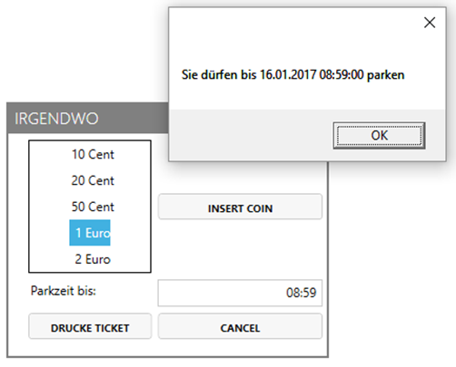
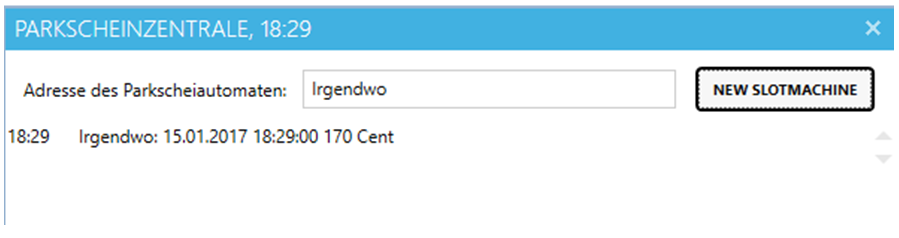

# Parking Ticket Machine

# Lernziele

* .NET Collections
* Events

# Allgemein

Die schnell laufende Uhr (`FastClock` mit Faktor 360) wird in die zentrale Verwaltung mehrerer Parkscheinautomaten integriert.

Die Hauptkomponenten der zweischichtigen Anwendung verwaltet beliebig viele Parkscheinautomaten (`SlotMachine` mit Wpf-View `SlotMachineWindow`) und eine zentrale Steuerung (`MainWindow`), mit der neue Automaten angelegt werden können und die Verkäufe von Tickets der Automaten dokumentiert werden.

Die Anwendung ist objektorientiert aufzubauen. Das heißt, nicht die Abläufe stehen im Zentrum des Entwurfs sondern die realen Objekte (Parkscheinautomat, Buchung, ...). 

# Hauptfenster

Über das Hauptfenster werden neue Parkscheinautomaten angelegt und die Verkäufe der Tickets der einzelnen Automaten dokumentiert. Dazu meldet sich das Hauptfenster mit einem EventHandler an den erzeugten Automaten an.

Das Hauptfenster zeigt in der Titelleiste die aktuelle Zeit der FastClock an.

Mit Programmstart werden sofort zwei Automaten (Limesstrasse, Landstrasse) erzeugt.

# SlotMachineWindow

Der Parkscheinautomat ist in der Lage, den Münzeinwurf abzuwickeln und nach erfolgreichem Abschluss die Zentrale über den Verkauf eines Tickets zu verständigen.

Folgende Nebenbedingungen sind einzuhalten:

* Der sehr günstige Tarif beträgt 1€ pro Stunde.
* Minimaleinwurf 50 Cent => 30 Minuten
* Wurde keine Münze ausgewählt, wird eine entsprechende Meldung ausgegeben.
* Maximale Parkdauer 90 Minuten. Mehreinwurf ist erlaubt => Spende an die Gemeinde.
* Die Zeit zwischen 18:00 und 8:00 ist kostenfrei und muss daher ausgespart werden. Ein Einwurf von 1€ um 17:30 ergibt daher die Parkdauer bis 8:30 am nächsten Tag.
* Während des Ticketkaufs wird die schnell laufende Uhr angehalten.
* Nach Abschluss des Ticketkaufs (Print Ticket oder Cancel) läuft die Uhr wieder weiter und die Parkzeit wird wieder gelöscht.
  
  

* Der Ticketverkauf wird im Hauptfenster dokumentiert

  

# Hinweise
* Parkscheinautomaten sind Unterfenster des Hauptfensters (aber keine modalen Dialoge). Verwenden Sie das Property Owner, um dies festzulegen.
* Das `SlotMachineWindow` verwendet für die Businessmethoden (`InsertCoin`, `PrintTicket`, `Cancel`) die zugrunde liegende Businessklasse `SlotMachine`. Die selbe SlotMachine kann dann auch für WinForms oder andere Visulisierungstechnologien verwendet werden. Die Logik bleibt dann unabhängig von der GUI auch testbar.
* Mit `MessageBox.Show()` können Sie Meldungen auf den Bildschirm ausgeben.

